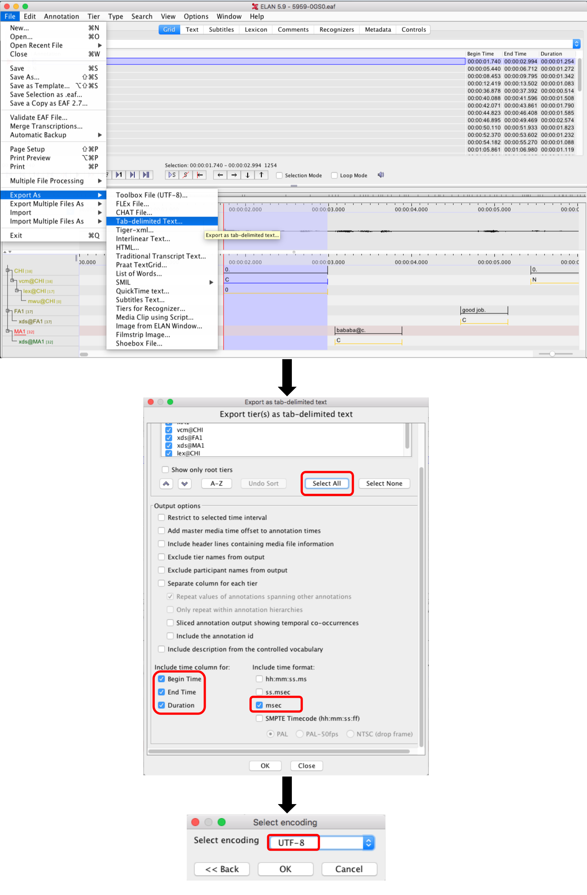

# Background

A big part of the lab manager's job will be to write scripts that facilitate data collection, annotation, and analysis. This technical task is meant to give you an idea of the type of work involved in prepping data for analysis.

When RAs manually annotate data in the lab, they may use one of several applications, depending on the type of data (e.g., Excel/Google Spreadsheets, Praat, ELAN, Datavyu, etc.). When it comes to doing analysis, however, we need to get their annotations into a text-based tabular format. Usually this can be done by hand within each application (e.g., via some specialized export function) but it's often much quicker and less error-prone to do this re-formatting automatically.

I have provided you here with an .eaf file. This file type is used in the application [ELAN](https://archive.mpi.nl/tla/elan) and, underlyingly, it is just XML. I am also providing you with an example of a tab-delimited text file. The text file features a few of the key fields that we typically use for analysis with transcribed data. I created the text file by exporting it manually in the ELAN environment and selecting a subset of the output options, as shown here.

## Task summary

Your task is to create a tool that takes, as input, an .eaf file (structured as in the example) and gives, as output, a .txt file (structured as in the example). The output file should appear next to the input file in the same directory by default, and with the same basename as the input file. You can accomplish this task in up to three ways:

### Level 1: R script, hard-coded paths

Provide me with a single script/set of scripts in R in which:

* I can define a path to an input .eaf file and then
* Run the whole script to create the desired output file.

_Why this level?_ Students and RAs in the lab who are just learning how to script are likely doing so in R, particularly in RStudio. Even if they're just beginning, they will probably know how to open, minorly edit, and run individual scripts, and so would be able to use this tool independently.

### Level 2: Command-line script, paths as arguments

Provide me with a shell script and associated code for running this tool at the command line. Your tool should:

* Take an input path as an argument,
* Provide usage info for the arguments (and any flags you create), and
* Be able to run over single files or batches of files, e.g., at input `PATH/*.eaf`

Note: Use R or Python, as you like.

_Why this level?_ More advanced students and researchers who want to reuse our lab's open-source code are likely to be comfortable running scripts at the command line, often finding this more convenient than having to hand-edit a script in order to adjust it to their requirements.

### Level 3: Shiny app, GUI upload/download

Provide me with an R [Shiny app](https://shiny.rstudio.com/) and associated code in which:

* The user can upload one or more .eaf files via an upload button,
* Click 'submit' once the file has uploaded, and then
* Download the associated output file(s).

_Why this level?_ Everyone can use this tool, no matter their experience with programming, which makes it incredibly useful.

## Submission

Please share with me a GitHub repo in which you have stored your code. If you are doing level 3, you can either just have me run the app myself locally using `shiny::runApp()` or you can host it and send me a URL (up to you!). Indicate in the README of that repo which level you have aimed at. I have a collection of other files similar to the example one that I will use to test your tool. I'm on a Mac so whatever you do to mitigate my needing to install things/change paths (e.g., from back- to forward-slash) is appreciated :)

## Evaluation

I'm giving you multiple options for completing the task because the candidates for this position vary in their current programming skills and familiarity with R. The goal is not to test whether you can do all these things, but just to evaluate what your current comfort level is—do not feel compelled to do level 3 by default! Instead, choose the level that most suits your current skills and available time between now and Monday night. I will be looking at your code style, commenting, tests, edge case handling, README clarity, etc. Your task should run successfully and be tidily documented in line with your current best ability. Quality counts over quantity/level number.

Resourcefulness is a virtue! Feel free to use existing packages  that might make this task simpler. You may also find solutions posted for similar tasks—great! Just please clearly cite any code you re-use.

Last but not least, I'd appreciate it if you kept your full revision history for this project in the Github repo. I won't go snooping deep into your history so don't be bashful. I just want to get a sense for how you chunk your commits and what your messages are like.